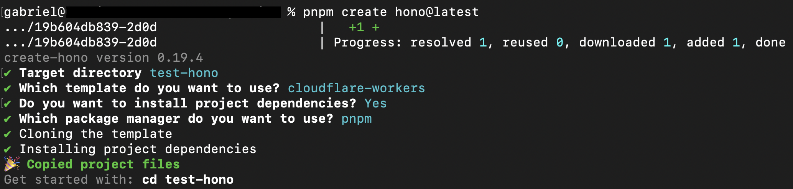

# Test Hono

## Create a new project

```bash
pnpm create hono@latest
```



## Install dependencies and run the development server

```bash
pnpm install
pnpm run dev
```

```bash
pnpm run deploy
```

[For generating/synchronizing types based on your Worker configuration run](https://developers.cloudflare.com/workers/wrangler/commands/#types):

```bash
pnpm run cf-typegen
```

Pass the `CloudflareBindings` as generics when instantiation `Hono`:

```typescript
// src/index.ts
const app = new Hono<{ Bindings: CloudflareBindings }>()
```
